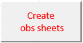
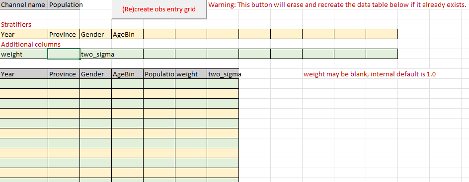

# Ingest Form How-to guides

## How to generate or delete observation data sheets

Adding and removing observational data sheets are both accomplished in an ingest form by use of an Excel macro
on the **Observations metadata** sheet. The macro is executed by clicking this button:

Steps:

1. Add or delete Data Channel entries.
2. Select or deselect (deselecting means set to: **--select--**) the corresponding scaling type. Scaling means the 
data channel scales with population (e.g. a population count) and Non-scaling means it does not (e.g. a population 
fraction).
3. Click the above button.

Any observational data sheets that were specified that did previously exist will be created, and any that are no
longer specified will be deleted.

## How to generate or recreate an observation data sheet data entry grid

On the desired observational data sheet:

1. Edit the **Stratifiers** and **Additional columns**
2. Click the following button.

A blank matching data entry grid will be generated. If one already existed, it will be erased and replaced by a blank
table.
 
Example of successful generation:

