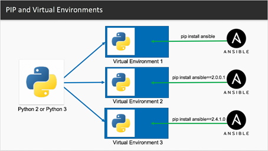

# Virtual Environments

## Why use virtual environments

- A virtual environment is a self-contained folder with its own Python interpreter
and libraries. It’s already part of python. 
- It helps keep different projects isolated and organized.
- Avoids conflicts between project dependencies.
- Easily replicate environments across machines using requirements.txt or
pyproject.toml files
- Test and run different projects using different versions of the same package.
- Try out new packages or upgrades without affecting global Python.
- Keeps your system environment clean and uncluttered.



## How to use virtual environments

### Create a virtual environment

```doscon
python -m venv myvenv
```

### Activate a virtual environment

=== "Windows"
    ```doscon
    myenv\Scripts\activate.bat
    ```
=== "Mac/Linux"
    ```doscon
    source myenv/bin/activate
    ```

Now you’re “inside” the environment

### Install packages into the virtual environment

Sometimes it is good to make sure PIP is up to date:

```
python -m pip install --upgrade pip
```

Now, you have an environment where you can install the latest version of emodpy-workflow!!!

```
pip install hiv-workflow –extra-index-url=https://packages.idmod.org/api/pypi/pypi-production/simple
```

### Deactivate a virtual environment

When you are done or need to switch to a different project, use the following command
to exit the virtual environment:

```
deactivate
```
