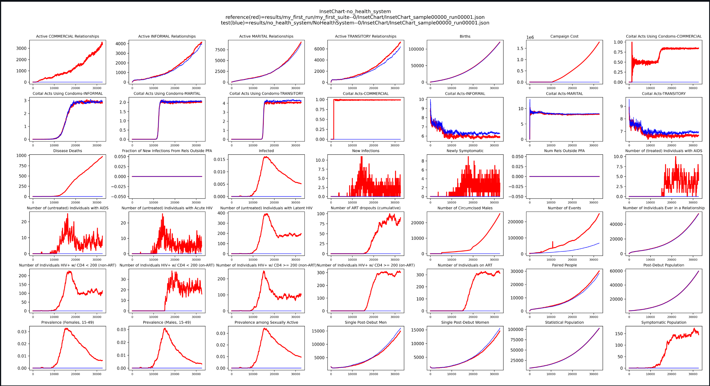
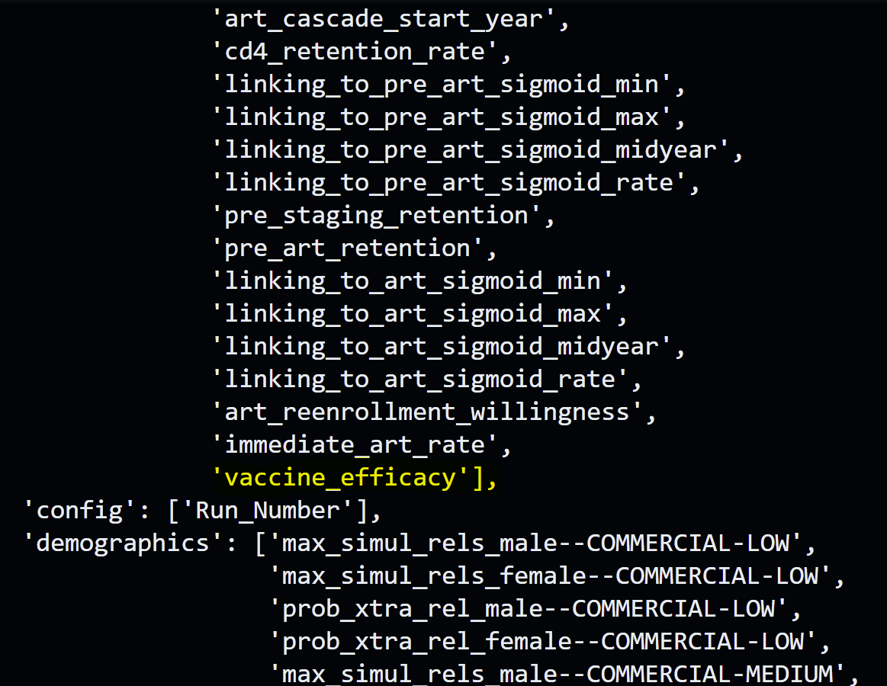
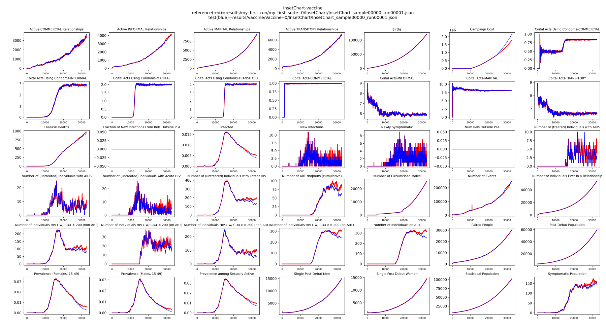
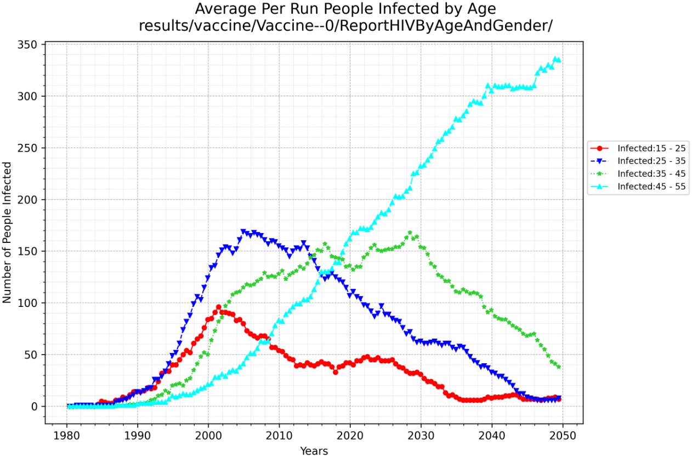
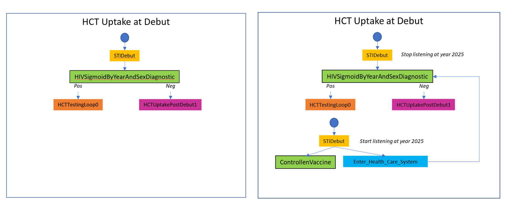
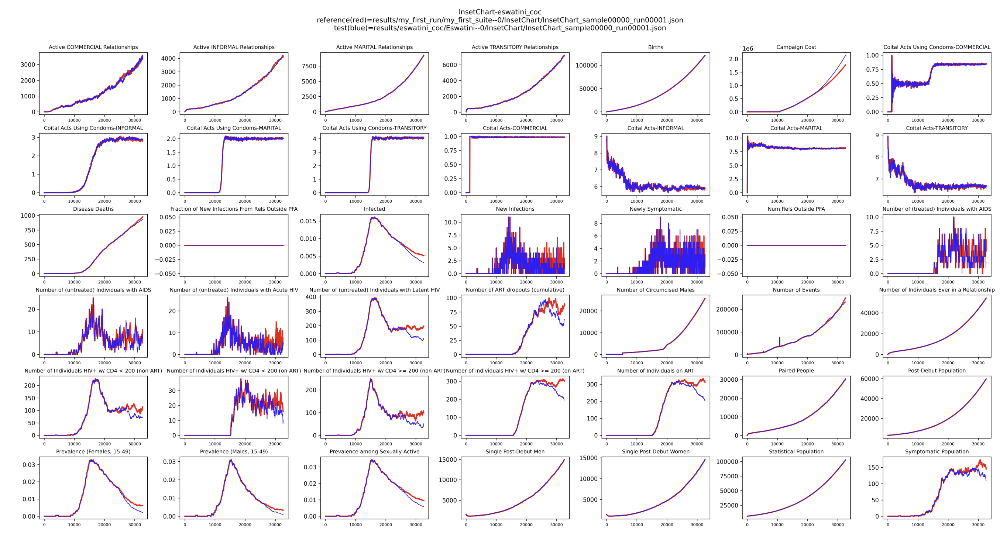
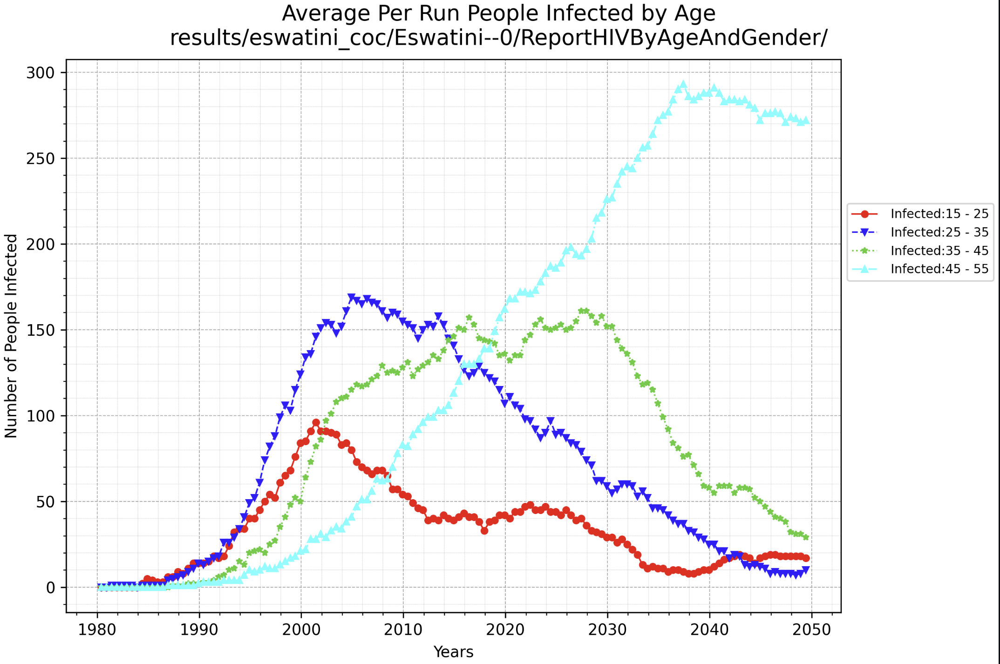

# Modify Campaign

## 1. Campaign Basics

The **campaign** is the primary mechanism in EMOD for introducing changes in the simulation over time. It defines when, 
where, and to whom interventions are delivered. Through campaigns, you can simulate programmatic activities such as HIV 
testing, ART initiation, PrEP rollout, and more. Campaigns control behavior through event-based triggers, targeting 
criteria, and time-based schedules.

In Emodpy 2.0, modular building blocks for the campaign module have been introduced, giving users the flexibility to 
mix and match components as needed. Previously, interventions and their distribution mechanisms (event coordinators) 
were tightly coupled. Now, they are separated, making it easier to adjust how interventions are distributed and how 
other campaign logic is configured.

## 2. Cascade of Care in the HIV Health System

The **cascade of care (CoC)** in `emodpy-hiv` models the journey of individuals through the HIV care continuum, 
including testing, linkage to care, treatment initiation, and retention. The CoC is represented as a series of states 
that individuals can transition through based on interventions and their health status. 
Key states in the CoC include:

- HCT (HIV Counseling and Testing)
- Linkage to ART or PrEP
- ART initiation and retention
- Loss to follow-up and reengagement

These states are configurable and form a modular representation of the HIV health system embedded in the campaign logic.
## 3. Prerequisites
Before starting this tutorial, please complete the following:
- [Create a project](./create_project.md) tutorial to create a new project with a baseline frame.
- [Run EMOD](./run_emod.md) tutorial to understand how to run simulations and plot results with baseline frame.

## 4. Minimal Campaign Example: Removing All Campaign Features
This example demonstrates how to create a minimal campaign by removing all campaign features. This approach is useful 
for establishing a baseline simulation without any interventions, triggers, or programmatic activities.

### 4.a. Create a baseline frame with minimal campaign

To create a frame from the baseline, run:

```bash
python -m emodpy_workflow.scripts.extend_frame --source baseline --dest minimal_campaign
```

This copies the `baseline` configuration and allows you to remove or simplify the CoC logic in `minimal_campaign`. For 
this example, we will remove all campaign features.

In the `frames/minimal_campaign` directory, open `campaign.py`. Remove all campaign elements from the country model by 
updating the `get_campaign_parameterized_calls` function to return an empty list. This ensures no interventions or 
events are included in the campaign, while still calling the country model's `initialize_campaign` function to retain 
essential setup (such as Base_Year).
```python
def get_campaign_parameterized_calls(campaign: emod_api.campaign) -> List[ParameterizedCall]:
    # parameterized_calls = source_frame.model.campaign_parameterizer(campaign=campaign)
    # Add any additional ParameterizedCalls here
    parameterized_calls = []
    return parameterized_calls
```

### 4.b. Run EMOD

Run the simulation:

```bash
python -m emodpy_workflow.scripts.run -N MinimalCampaign -F minimal_campaign -o results/minimal_campaign -p ContainerPlatform
```

Please see the [run EMOD](./run_emod.md) tutorial for more details on this command.

### 4.c. Plot InsetChart

After running the simulation, you can examine the results by plotting the InsetChart to compare the minimal campaign 
with the baseline.
First, Download the InsetChart to the `results/minimal_campaign` directory:

```bash
python -m emodpy_workflow.scripts.download -f output/InsetChart.json -r results/minimal_campaign/experiment_index.csv -p ContainerPlatform
```

Use the plotting tool to compare the output with the baseline:

```bash
python -m emodpy_hiv.plotting.plot_inset_chart results/my_first_run/my_first_suite--0/InsetChart/InsetChart_sample00000_run00001.json -d results/minimal_campaign/MinimalCampaign--0/InsetChart/ -t "InsetChart-minimal_campaign" -o images/minimal_campaign
```
Here is an example of what you might see in the InsetChart comparing baseline and minimal_campaign:

## 5. Modify the campaign inside a frame directly
You may want to simulate a **change in outcomes** (like introducing a vaccine) without modeling every step in the 
delivery system.
Please follow the steps below to add a vaccine to campaign.

### 5.a. Extend frame
Let's extend the baseline frame to create a new frame called `vaccine`:
```bash
python -m emodpy_workflow.scripts.extend_frame --source baseline --dest vaccine
```

### 5.b. Add HIV Vaccine directly

Modify `campaign.py` under `/workspaces/emodpy-workflow/my_project/frames/vaccine` folder to include a function that 
adds a vaccine intervention. This example adds:
- Add a ControlledVaccine with a constant WaningConfig.
- Set initial efficacy = 1.0 by default.
- Distribute the vaccine using STIDebut.
- Start at year 2026.
- Make initial efficacy a hyperparameter of the method.


```python linenums="1"
from emodpy_hiv.campaign.individual_intervention import ControlledVaccine
from emodpy_hiv.campaign.distributor import add_intervention_triggered
from emodpy_hiv.campaign.waning_config import Constant


def add_hiv_vaccine(campaign, vaccine_efficacy=1.0):
    vaccine = ControlledVaccine(
        campaign=campaign,
        waning_config=Constant(constant_effect=vaccine_efficacy)
    )
    add_intervention_triggered(
        campaign=campaign,
        intervention_list=[vaccine],
        triggers_list=["STIDebut"],
        start_year=2026
    )
    return campaign
```
In the same `campaign.py` file, add the following line in the `get_campaign_parameterized_calls` function to call the 
function.

```python linenums="1"
def get_campaign_parameterized_calls(campaign):
    parameterized_calls = source_frame.model.campaign_parameterizer(campaign=campaign)
    # Add any additional ParameterizedCalls here
    pc = ParameterizedCall(func=add_hiv_vaccine, hyperparameters={'vaccine_efficacy': None})
    parameterized_calls.append(pc)
    return parameterized_calls
```
### 5.c. Check hyperparameter
You can check that the `vaccine_efficacy` parameter becomes a hyperparameter for campaign.py by running:
```bash
python -m emodpy_workflow.scripts.available_parameters -F vaccine
``` 
You should see `vaccine_efficacy` listed under Campaign parameters.



### 5.d. Run EMOD

```bash
python -m emodpy_workflow.scripts.run -N Vaccine -F vaccine -o results/vaccine -p ContainerPlatform
```
- Optional: Check that ControlledVaccine is added to campaign.json.

Please see the [run EMOD](./run_emod.md) tutorial for more details on this command.

### 5.e. Plot InsetChart

After running the simulation, you can examine the results by plotting the InsetChart to compare the vaccine frame with 
the baseline.
Let's download the InsetChart to the `results/vaccine` directory:
```bash
python -m emodpy_workflow.scripts.download -f output/InsetChart.json -r results/vaccine/experiment_index.csv -p ContainerPlatform
```
Plot InsetChart and compare with baseline:
```bash
python -m emodpy_hiv.plotting.plot_inset_chart results/my_first_run/my_first_suite--0/InsetChart/InsetChart_sample00000_run00001.json -d results/vaccine/Vaccine--0/InsetChart -t "InsetChart-vaccine" -o images/vaccine
```
Compare it with the results from baseline, you should see prevalence drops but costs go up after year 2026 when the 
vaccine is introduced.

Visualize results:


### 5.f. Plot ReportHIVByAgeAndGender
You can plot ReportHIVByAgeAndGender so you can look at prevalence across age groups.

First, you need to download the ReportHIVByAgeAndGender to the `results/vaccine` directory:

```bash
python -m emodpy_workflow.scripts.download -f output/ReportHIVByAgeAndGender.csv -r results/vaccine/experiment_index.csv -p ContainerPlatform
```
Visualize prevalence across age groups:

```bash
python -m emodpy_hiv.plotting.plot_hiv_by_age_and_gender results/vaccine/Vaccine--0/ReportHIVByAgeAndGender/ -p prevalence -a -m -o images/vaccine
```
Here is an example of what you might see in the ReportHIVByAgeAndGender for vaccine frame:


## 6. Modify the campaign by changing the Country Model
### 6.a. Country Model Basics

A **country model** in `emodpy-hiv` encapsulates campaign logic specific to a setting (like Zambia).
Subclassing allows you to override methods like `add_state_HCTUptakeAtDebut()` to customize intervention logic.

You can find country models in the `emodpy_hiv/country` directory. Each country model is a subclass of the base 
`Country` class and implements methods to define the cascade of care and other interventions.You can create a new 
country model by subclassing an existing one and overriding specific methods to change behavior. This allows you to 
tailor the campaign logic to different settings or scenarios, which has more control than editing the campaign.py 
inside the frame.

In this example, we will create a new country model for Eswatini by subclassing the Zambia country model and modifying 
the `add_state_HCTUptakeAtDebut()` method to distribute a long-lasting form of PrEP at sexual debut.

### 6.b. Create Eswatini country model

In the modified_coc directory, create a new country model called Eswatini by subclassing the Zambia Country Model and 
overrides add_state_HCTUptakeAtDebut() method to distributes the vaccine when they debut.
Here are the steps:

1. *Copy the `add_state_HCTUptakeAtDebut()` Function:*

    Copy this function from the Country class and cascade_of_care.py to your new subclass.

2. *Modify Event Listening Duration:*

   Adjust the copied function so that it behaves like the baseline, but stops after 35 years or by 2025 (i.e., stop 
   listening for the STIDebut event after that time).
3. *Insert Long-Lasting PrEP Distribution:*

   Before the normal decision point (the sigmoid choice), add code to distribute a very long-lasting form of PrEP.

4. *Update Uptake Choice Based on New Event:*

   Modify the distribution of the uptake choice so it depends on the new sigmoid_event.

On the left side is the original function from Zambia, and on the right is the modified function for Eswatini.

| Left: Zambia (original) | Right: Eswatini (modified) |
|-------------------------|----------------------------|

Example `eswatini.py`:

*In this example, the ZambiaForTraining class serves as the base for Eswatini. ZambiaForTraining is similar to the 
Zambia country model but utilizes a smaller population to accelerate simulation time. You may select an alternative 
base class if required.*
```python linenums="1"
import emod_api
from emodpy_hiv.campaign.distributor import add_intervention_triggered
from emodpy_hiv.campaign.individual_intervention import (
    HIVSigmoidByYearAndSexDiagnostic,
    ControlledVaccine,
    BroadcastEvent,
    Sigmoid
)
from emodpy_hiv.campaign.common import CommonInterventionParameters, PropertyRestrictions
import emodpy_hiv.campaign.cascade_of_care as coc
from emodpy_hiv.countries import ZambiaForTraining 
from emodpy_hiv.campaign.waning_config import Constant


class Eswatini(ZambiaForTraining):
    country_name = "eSwatini"

    @classmethod
    def add_state_HCTUptakeAtDebut(
        cls,
        campaign: emod_api.campaign,
        start_year: float,
        node_ids: list[int] = None
    ):
        disqualifying_properties = [
            coc.CascadeState.LOST_FOREVER,
            coc.CascadeState.ON_ART,
            coc.CascadeState.LINKING_TO_ART,
            coc.CascadeState.ON_PRE_ART,
            coc.CascadeState.LINKING_TO_PRE_ART,
            coc.CascadeState.ART_STAGING
        ]
        initial_trigger = coc.CustomEvent.STI_DEBUT
        hct_upate_at_debut_pv = coc.CascadeState.HCT_UPTAKE_AT_DEBUT

        # set up health care testing uptake at sexual debut by time
        # stop listing for STIDebut after 35 years.
        female_multiplier = 1.0
        duration = 365 * 35
        uptake_choice = HIVSigmoidByYearAndSexDiagnostic(
            campaign,
            year_sigmoid=Sigmoid(min=-0.005, max=0.05, mid=2005, rate=1),
            positive_diagnosis_event=coc.HCT_TESTING_LOOP_TRIGGER,
            negative_diagnosis_event=coc.HCT_UPTAKE_POST_DEBUT_TRIGGER_1,
            female_multiplier=female_multiplier,
            common_intervention_parameters=CommonInterventionParameters(
                disqualifying_properties=disqualifying_properties,
                new_property_value=hct_upate_at_debut_pv
            )
        )
        add_intervention_triggered(
            campaign,
            intervention_list=[uptake_choice],
            triggers_list=[initial_trigger],
            start_year=start_year,
            property_restrictions=PropertyRestrictions(
                individual_property_restrictions=[['Accessibility:Yes']]
            ),
            node_ids=node_ids,
            event_name='HCTUptakeAtDebut: state 0 (decision, sigmoid by year and sex)',
            duration=duration
        )

        # insert a long-lasting ControlledVaccine
        laprep_start_year = start_year + duration / 365
        vaccine = ControlledVaccine(
            campaign,
            waning_config=Constant(0.99),
            common_intervention_parameters=CommonInterventionParameters(
                disqualifying_properties=disqualifying_properties,
                new_property_value=hct_upate_at_debut_pv
            )
        )
        broadcast_event = BroadcastEvent(
            campaign=campaign,
            broadcast_event="Enter_Health_Care_System",
            common_intervention_parameters=CommonInterventionParameters(
                disqualifying_properties=disqualifying_properties,
                new_property_value=hct_upate_at_debut_pv
            )
        )
        add_intervention_triggered(
            campaign=campaign,
            intervention_list=[vaccine, broadcast_event],
            triggers_list=[initial_trigger],
            start_year=laprep_start_year,
            property_restrictions=PropertyRestrictions(
                individual_property_restrictions=[['Accessibility:Yes']]
            ),
            node_ids=node_ids,
            event_name='HCTUptakeAtDebut: LA-PrEP on STI Debut'
        )
        # distribute the SigmoidByYearAndSexDiagnostic intervention by Enter_Health_Care_System event
        add_intervention_triggered(
            campaign,
            intervention_list=[uptake_choice],
            triggers_list=["Enter_Health_Care_System"],
            start_year=laprep_start_year,
            property_restrictions=PropertyRestrictions(
                individual_property_restrictions=[['Accessibility:Yes']]
            ),
            node_ids=node_ids,
            event_name='HCTUptakeAtDebut: state 0 triggered by Enter_Health_Care_System after 2025'
        )
        return (
            coc.HCT_TESTING_LOOP_TRIGGER,  # return the trigger for the HCTTestingLoop state
            coc.HCT_UPTAKE_POST_DEBUT_TRIGGER_1
        )
```
### 6.c. Create new frame

Make a new frame with this new Eswatini country model:

```bash
python -m emodpy_workflow.scripts.new_frame --country Eswatini --dest eswatini_coc
```
Now move the `eswatini.py` file to the new frame: `frames/eswatini_coc` directory. Ideally, if you want to make 
this new country model reusable, you can put it in the `emodpy_hiv/country` directory and import it in `campaign.py`. 
For this tutorial, we will keep it simple and just move the file to the frame directory.

Also, modify the import statement in `campaign.py`, `config.py`, and `demographics.py` to import the Eswatini country 
model:

In these files, comment out the existing import statement for the country model and add the new import statement for 
Eswatini:

```python linenums="1"
# from emodpy_hiv.countries import Eswatini as country_model
import sys, os
sys.path.insert(0, os.path.dirname(os.path.abspath(__file__)))
from eswatini import Eswatini as country_model
```

### 6.d. Run EMOD

```bash
python -m emodpy_workflow.scripts.run -N Eswatini -F eswatini_coc -o results/eswatini_coc -p ContainerPlatform
```
Please see the [run EMOD](./run_emod.md) tutorial for more details on this command.

### 6.e. Plot insetChart

After running the simulation, you can examine the results by plotting the InsetChart to compare the eswatini_coc frame 
with the baseline.
Download the InsetChart to the `results/eswatini_coc` directory:

```bash
python -m emodpy_workflow.scripts.download -f output/InsetChart.json -r results/eswatini_coc/experiment_index.csv -p ContainerPlatform
```

Use the plotting tool to compare the output with the baseline:

```bash
python -m emodpy_hiv.plotting.plot_inset_chart results/my_first_run/my_first_suite--0/InsetChart/InsetChart_sample00000_run00001.json -d results/eswatini_coc/Eswatini--0/InsetChart/ -t "InsetChart-eswatini_coc" -o images/eswatini_coc
```
Here is an example of what you might see in the InsetChart comparing baseline and eswatini_coc:


You should see prevalence drops but costs go up after year 2025 when the long-lasting PrEP is introduced.

### 6.f. Plot ReportHIVByAgeAndGender

Plot prevalence in ReportHIVByAgeAndGender across ages to see how it takes a while before we see prevalence drop in 
the older groups:

First, you need to download the ReportHIVByAgeAndGender to the `results/eswatini_coc` directory:

```bash
python -m emodpy_workflow.scripts.download -f output/ReportHIVByAgeAndGender.csv -r results/eswatini_coc/experiment_index.csv -p ContainerPlatform
```
Visualize prevalence across age groups:

```bash
python -m emodpy_hiv.plotting.plot_hiv_by_age_and_gender results/eswatini_coc/Eswatini--0/ReportHIVByAgeAndGender/ -p prevalence -a -m -o images/eswatini_coc
```
Here is an example of what you might see in the ReportHIVByAgeAndGender for eswatini_coc frame:


### 6.g. Optional: Public Eswatini Country Model
If you want to make the Eswatini country model reusable, you can put it in the emodpy_hiv/country directory and import 
it in campaign.py. Here are the steps:
1. move `eswatini.py` to `/emodpy-hiv/emodpy_hiv/countries/eswatini/eswatini.py`

2. add a `__init__.py` file under `emodpy_hiv/countries/eswatini` folder with:
```python
from .eswatini import Eswatini # noqa: F401
```

3. add this line to `__init__.py` file under `emodpy_hiv/countries` folder:
```python
from emodpy_hiv.countries.eswatini import Eswatini # noqa: F401
```

4. go to emodpy_workflow, reinstall emodpy-hiv with the new change, verify you can use the new Country Eswatini model 
by running:
```bash
python -m emodpy_workflow.scripts.new_frame --country Eswatini --dest Eswatini
python -m emodpy_workflow.scripts.available_parameters -F Eswatini
python -m emodpy_workflow.scripts.run -N Eswatini -F Eswatini -o results/Eswatini -p ContainerPlatform
```
You should not need to edit the `campaign.py`, `config.py` or `demographics.py` file in the frame anymore.

## 7. Conclusion

This tutorial demonstrated how to modify campaign logic in EMOD simulations using the `emodpy_workflow`, including 
creating minimal campaigns, adding interventions directly, and customizing country models for advanced scenarios. By 
mastering these techniques, you can tailor simulations to specific research questions and programmatic needs.

For further customization, refer to the following tutorials:
- [Modify Config](./modify_configuration.md): Adjust simulation parameters and settings.
- [Modify Demographics](./modify_demographics.md): Change population structure and attributes.
- [Modify Reports](./modify_reports.md): Customize output reports and data collection.

Combining these approaches enables comprehensive control over your EMOD workflows and simulation outcomes.