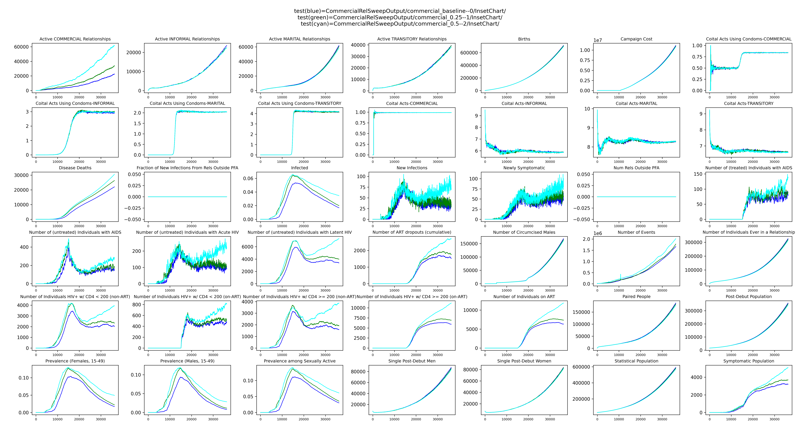

# Modify Demographics

## What are demographics?

Demographics in EMOD contains information related to the properties of the simulated population. In particular, the
following are included:

* Initial population
* Initial age distribution
* Birth rates
* Mortality rates

In EMOD-HIV, additional relationship information is included:

* Relationship formation rates and age-based assortivity
* Relationship concurrency rates
* Condom usage by relationship type

If EMOD is being run in a spatial, multi-node configuration, the above demographics information will often be stratified
spatially (e.g. by node or province).

Another aspect of demographics in EMOD is **individual properties**. Individual properties are essentially state "tags"
that can be applied to model agents. These highly flexible labels are defined and initialized in EMOD demographics input
according to observational statistics. More information can be found in the 
[IndividualProperties reference documentation](https://docs.idmod.org/projects/emodpy-hiv/en/latest/emod/model-properties.html).

The standard Zambia country model demographics configuration can be found in``emodpy_hiv/countries/zambia/zambia.py`` 
in functions:

* initialize_demographics
* get_demographics_parameterized_calls

Numerous pre-defined hyperparameters exist for demographics configuration modification.

## Adding a new IndividualProperty

Adding a new IndividualProperty is covered in the [individual properties how-to](../how_to/how_to_use_individual_properties.md).


## Relationship types

The standard configuration of EMOD-HIV represents four different types of relationships:

* Marital
* Informal
* Transitory
* Commercial

Depending on their age, gender, spatial location, etc., a model agent may enter into no, one, or multiple types (and
counts) of relationships. Demographics parameters exist to specify, for each relationship type:

* The rate of such relationship formation
* Distribution of relationship duration
* The maximum number of such relationships any given agent may have
* The coital act rate
* The likelihood of condom usage per coital act

## Example - Modifying commercial relationship formation

### Create a new project and a new Zambia baseline frame

```bash 
python -m emodpy_workflow.scripts.new_project -d demographics_tutorial
cd demographics_tutorial

python -m emodpy_workflow.scripts.new_frame --country Zambia --dest baseline
```

### Create a sweep file to increase commercial relationship formation rate

Creating a sweep file is covered in [how to sweep](../how_to/how_to_sweep.md).

For this tutorial, the file `sweeps.py` should contain:

```python 
parameter_sets = {
    'baseline': {
        'sweeps': [
            {'experiment_name': 'commercial_baseline'},
            {'experiment_name': 'commercial_0.25', 'formation_rate--COMMERCIAL': 0.25},
            {'experiment_name': 'commercial_0.5', 'formation_rate--COMMERCIAL': 0.5},
        ]
    }
}
```

### Run EMOD and download InsetChart.json

Use the `run` command to execute EMOD using the defined sweeps file and download InsetChart.json:

```bash 
python -m emodpy_workflow.scripts.run -f baseline -N CommercialRelSweep -d output/InsetChart.json -o CommercialRelSweepOutput -p ContainerPlatform -w sweeps.py
```

Information about the use of the `run` command for sweeps is in the 
[sweep parameter tutorial](sweep_parameter.md).

### Compare InsetChart.json with and without increased commercial relationships

InsetChart.json files for all sweeps defined are located in the folder `CommercialRelSweepOutput`, with subfolders
containing all simulations belonging to each sweep/experiment. In this case, there is one InsetChart.json each.

They will look something like this when viewed with this command:

```bash
python -m emodpy_hiv.plotting.plot_inset_chart_mean_compare CommercialRelSweepOutput/commercial_baseline--0/InsetChart/ CommercialRelSweepOutput/commercial_0.25--1/InsetChart/ CommercialRelSweepOutput/commercial_0.5--2/InsetChart/
```




